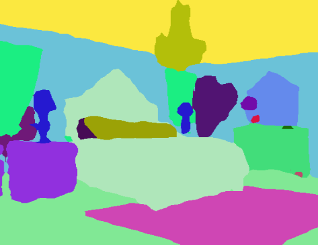

# Image Segmentation Keras : Implementation of Segnet, FCN, UNet, PSPNet and other models in Keras.

Implementation of various Deep Image Segmentation models in keras.

  

## Training using GUI interface
You can also train segmentation models on your computer with https://liner.ai  

Train   |  Inference / Export
:-------------------------:|:-------------------------:
  |  
  |  

Example results for the pre-trained models provided :

Input Image            |  Output Segmentation Image
:-------------------------:|:-------------------------:
  |  
  |  

